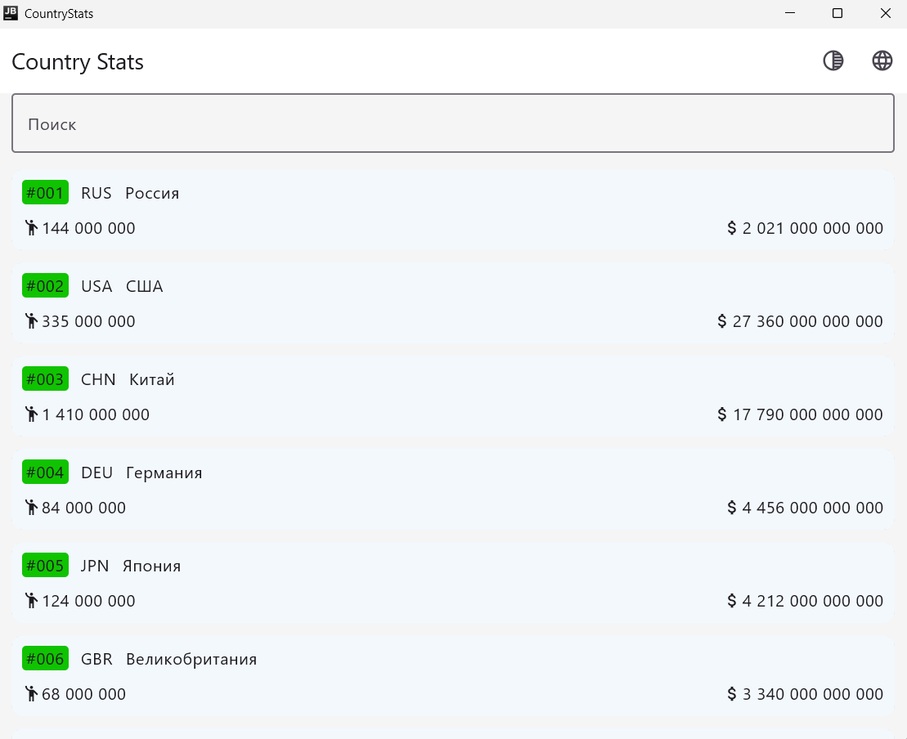
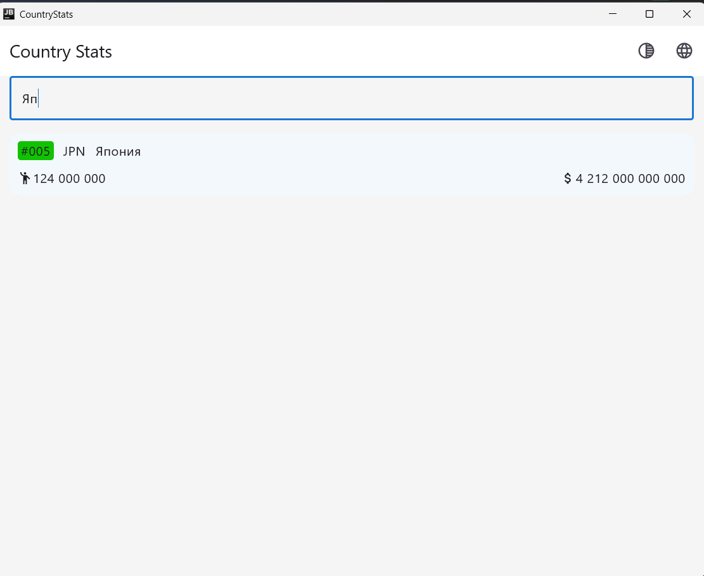
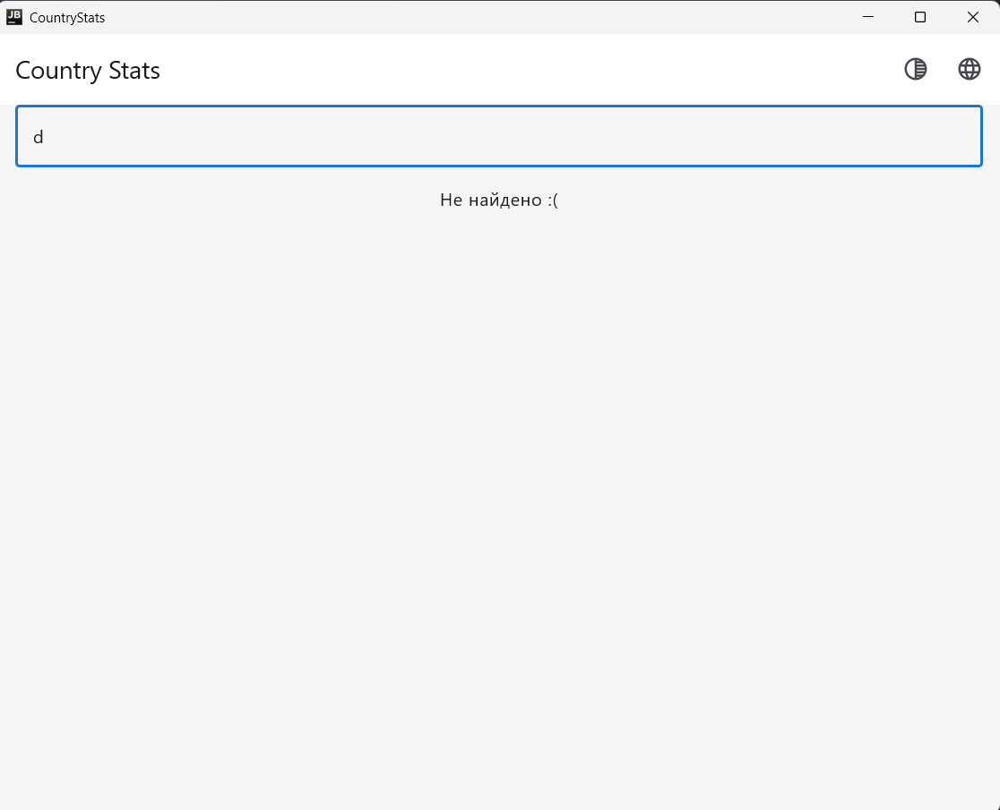
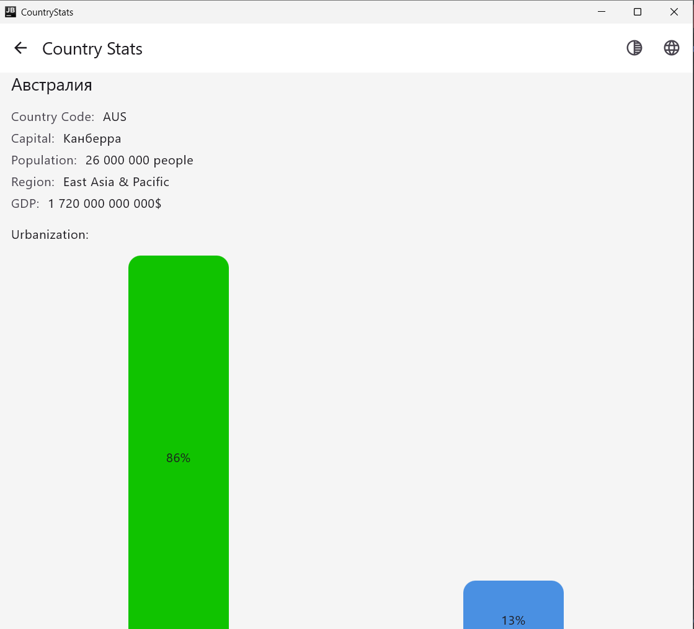
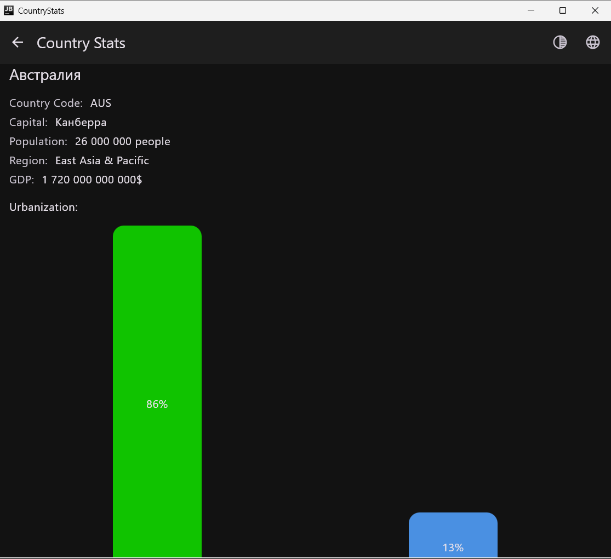

# Отчёт по лабораторной работе №1

## Тема

Разработка кроссплатформенного приложения Country Stats на Kotlin Multiplatform с использованием Compose Multiplatform и Navigation 3.

## Предметная область

Приложение представляет собой каталог стран с основной статистикой. Для каждой страны отображаются:

- название, код, столица, регион;
- население, городское и сельское население (в процентах);
- ВВП.

Список стран можно фильтровать по названию. При выборе страны открывается детальный экран с полной информацией и списком стран-соседей по региону. Данные на текущий момент берутся из моков (`CountryMocks`) — 20 стран, покрывающих разные регионы.

## Архитектура

Проект разделён на три слоя:

### `data/`

- `Country` — модель данных.
- `CountryMocks` — список моковых стран.
- `CountryRepositoryImpl` — реализация репозитория.

### `domain/`

- `CountryRepository` — интерфейс репозитория и extension-функции (`getCountries(filter)`, `getNeighbours`, `filterByName`).
- `Screen` — sealed-интерфейс для навигации.
- UI-модели состояний и интентов: `CountryListState`, `CountryDetailedState`, `CountryListIntent`.

### `ui/`

- `screen/` — экраны (`CountryListScreen`, `CountryDetailScreen`).
- `components/` — переиспользуемые компоненты (`CountryCard`, `CountryList`, `CountryDetailed`, `StatBlock`, `UrbGraphic`, `Bar`, `CardNum`, `CardStat`, `CardSurface`).
- `viewmodel/` — `CountryListViewModel`, `CountryDetailedViewModel`.
- `model/` — UI-модели (`CountryCardUI`), локализация (`AppLanguage`, `AppLocaleKey`).
- `AppScaffold`, `AppTheme`.

Навигация вынесена в `navigation/` (`AppNavDisplay`, `AppViewModel`).

## Как устроен поток данных

Экраны не знают про ViewModel и репозиторий. Они принимают только состояние и колбэки:

```kotlin
CountryListScreen(
    state = state,
    onQueryChange = {...},
    onCountryClick = {...},
)
```

ViewModel хранит `MutableStateFlow` состояния, обрабатывает интенты и обновляет состояние. Связка происходит в `AppNavDisplay`:

- `CountryListViewModel` создаётся один раз на всё приложение и живёт, пока живёт экран.
- `CountryDetailedViewModel` создаётся внутри `entry<Screen.Detail>` с ключом `"country-detail-${key.id}"`, чтобы у каждой страны была своя ViewModel.

Анимации переходов настраиваются через `transitionSpec` (вперёд — экран выезжает справа) и `popTransitionSpec` (назад — экран выезжает слева, что даёт ощущение возврата).

## Что реализовано

1. **Список стран с поиском.** Экран `CountryListScreen` содержит поле поиска (`OutlinedTextField`), связанное с `state.query`. Фильтрация выполняется в `CountryListViewModel.search()` через `repository.getCountries(filter)`.
   
   
2. **Заглушка «Ничего не найдено».** В компоненте `CountryList` при пустом списке показывается текст из ресурса `no_results` — «Не найдено :(» / «Not found :(».
   
3. **Детальный экран.** Показывает название, код, столицу, регион, население, ВВП, городское/сельское население в виде столбчатой диаграммы и список соседей по региону. Клик по соседу добавляет новую страну в back stack.
   
4. **Навигация.** `AppViewModel` хранит back stack. Верхняя панель показывает кнопку «назад», когда стек больше одного элемента.
5. **Локализация.** Переключение RU/EN через `AppLanguage` и `AppLocaleKey`. Строки хранятся в `composeResources/values/strings.xml` и `values-en/strings.xml`.
6. **Тёмная тема.** Переключение через иконку в верхней панели. Цветовые схемы определены в `AppTheme`.
   
## Команды запуска

```bash
# Android
./gradlew :androidApp:assembleDebug

# Desktop (JVM)
./gradlew :shared:run

# JS (browser)
./gradlew :webApp:jsBrowserDevelopmentRun

# Wasm (browser)
./gradlew :webApp:wasmJsBrowserDevelopmentRun
```